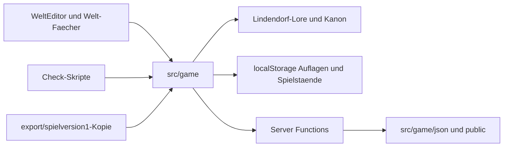
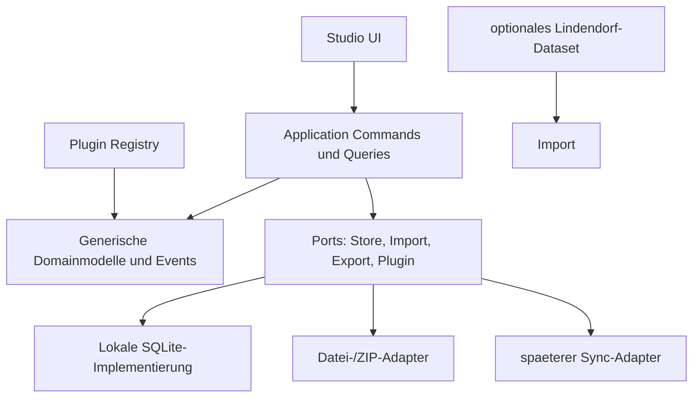

# WorldForge Studio: Transformationsaudit

Stand: 2026-09-25

## 0. Optimierter Auftrag

Analysiere das Repository vollstaendig, klassifiziere jede Datei und jedes Modul als `Tool`, `Infrastruktur`, `Inhalt` oder `Gemischt` und entwirf daraus eine eigenstaendige Offline-First-Plattform zur Erstellung und Verwaltung von Welten, Kampagnen, Quests, Dialogen, Ereignissen, Charakteren, Wissen und Assets. Der neue Kern muss mit einem leeren Workspace starten koennen. Die Lindendorf-Daten duerfen nur als optionales Fixture- oder Demo-Dataset existieren.

Das Zielprodukt heisst **WorldForge Studio**. Der Name passt besser als Adventure Studio, weil das Produkt nicht nur Abenteuer schreibt, sondern auch Regelwerke, Wissensmodelle und spaetere Plugins fuer Wirtschaft, Politik oder Stadtbau tragen soll.

### Abnahmekriterien

1. Ein leerer Workspace kann erstellt, geoeffnet, gespeichert, validiert und geschlossen werden.
2. Der Kern importiert keine Lindendorf-Lore, keine konkreten Figuren, keine Spielstaende und keine spielinternen Art- oder Flag-Schluessel.
3. Welten, Regionen, Orte, Figuren, Fraktionen, Kampagnen, Kapitel, Szenen, Quests, Dialoge, Ereignisse, Regeln, Wissenseintraege und Assets besitzen versionierte, generische Schemas.
4. JSON, YAML, Markdown, SQLite und ZIP-Projekt koennen deterministisch exportiert werden; ein Export kann wieder importiert und validiert werden.
5. Plugins koennen neue Inhaltstypen, Validatoren, Editoren und Exporter ueber einen stabilen Vertrag registrieren, ohne den Kern zu aendern.
6. Import, Migration, Validierung, Export und Plugin-Registrierung sind automatisiert getestet.
7. Kern, Adapter, UI und Demo-Dataset sind azyklisch und getrennt.

### Architekturprinzipien

- Modularer Monolith statt vorzeitiger Microservices.
- Domain Driven Design im Kern, Ports-and-Adapters an den Grenzen.
- Schema-first: Datenvertraege sind die oeffentliche Sprache zwischen Modulen.
- Offline-First mit SQLite als lokaler Quelle; Cloud-Sync bleibt ein Adapter.
- Commands veraendern den Workspace, Events informieren Projektionen und UI.
- Keine globale Domaenenlogik, keine UI-Imports in der Domaene, keine Dateisystemzugriffe in Schemas oder Entitaeten.
- Plugin-Code laeuft nur hinter versionierten Capabilities und Validierung.
- Inhalt ist Dataset; Werkzeug ist Produktcode.

## 1. Kurzbefund

Das Repository ist heute ein spielbares Lindendorf-Textabenteuer mit einer weit entwickelten Spielleiter-Werkstatt. Der wiederverwendbare Wert liegt nicht primaer in der Runtime, sondern in diesen Schichten:

- `src/components/welt/`: Editor- und Pruefoberflaechen fuer Karte, Quest, Kampagne, Wissen, Regeln, Zeitstrahl, Bibliothek und Graph.
- `src/game/gm/`: Werkstattvertraege, Mapping und Leckpruefung.
- `src/game/json/`: Zod-nahe JSON-Schemas, Szenen- und Wissensformate.
- `src/game/welt.ts`, `welt-graph.ts`, `szenen-katalog.ts`: Auflagen, Graphsicht und Katalogisierung.
- `src/game/export-modul.ts` und `scripts/`: Import, Export, Checks und deterministische Projektwerkzeuge.

Die Trennung ist noch nicht erreicht. `src/game/werkstatt.functions.ts` schreibt direkt nach `src/game/json/...`, ruft Lindendorf-Lore ab, kennt konkrete Art- und Portrait-Mengen und ist zugleich Server-Adapter, Domaenenlogik und Persistenz. `WeltEditor` bietet gleichzeitig Partie-, Auflagen-, Kanon-, Spieler- und Pruefoperationen an. `export/spielversion1-7170673/` ist eine weitere Quellkopie und muss aus dem Zielrepository herausgehalten werden.

## 2. Klassifikation

### Tool

- `src/components/welt/*`: UI fuer Editor, Graph, Karte, Quest, Kampagne, Wissen, Regeln, Zeitstrahl, Pruefung und JSON.
- `src/game/export-modul.ts`: schema-gepruefter JSON-Import/-Export.
- `src/game/editor-fluss.ts`, `editor-quests.ts`, `editor-assets.ts`: Graph-, Quest- und Asset-Pruefungen.
- `src/game/welt-graph.ts`, `szenen-katalog.ts`: Katalog- und Graphabfragen, nach Herausloesen generisch nutzbar.
- `src/game/werkstatt.functions.ts`: nur die Validierungs- und Transformationsanteile; Server- und Contentanteile muessen heraus.
- `scripts/check-*.mjs`: Teile als generische Validatoren uebernehmen, Teile als Lindendorf-Content-Gates in ein Fixture-Paket verschieben.
- `scripts/browser-smoke.mjs`, `scripts/preview.mjs`, Test-Runner und Build-Helfer: Infrastruktur-/Toolingbestandteile.

### Infrastruktur

- `package.json`, `tsconfig.json`, `vite.config.ts`, `eslint.config.mjs`.
- `src/router.tsx`, `src/routes/__root.tsx`, `src/routes/editor.tsx`: Shell/Adapter; die Spielleiterroute wird zu einer Studio-Route.
- `src/lib/*`, `server/*`, `migrations/*`, Auth- und App-Data-Adapter.
- `scripts/with-app-env.mjs`, PWA-, Preview-, Browser- und Migrationsskripte.
- React/Radix/Monaco/Zod/TanStack-Abhaengigkeiten. Monaco bleibt optionaler Quelltexteditor, nicht das Datenmodell.

### Inhalt

- `wiki/*`, `docs/figuren/*`, Lore-, Quest-, Orte-, Enden- und Weltchronik-Dokumente.
- `src/game/script.ts`, `quest-*.ts`, `content.ts`, `lager-content.ts`, `lore.ts`, `wissen-tafeln.ts` und konkrete Wissens-/Quest-JSONs.
- `src/game/json/ki-auflagen.json`, `volltexte.ts`, `text-pack.json` und `spielleiter-karten.json`, soweit sie Lindendorf-Texte enthalten.
- `public/`, `artifacts/`, `attachments/`, Bild-/Audio- und Kartenmaterial, sofern die Dateien konkrete Weltinhalte zeigen oder benennen.
- `export/spielversion1-7170673/`: Archiv-/Exportinhalt, nicht als Quelle.

### Gemischt und zu zerlegen

- `src/game/types.ts`: generische Szenen-/Spieltypen und konkrete Held-/Spieltypen trennen.
- `src/game/welt.ts`: generische Auflage und Lindendorf-Speichertricks trennen.
- `src/game/werkstatt-vertrag.ts`: generische Editorvertraege von Lindendorf-Stimme, Art-Liste und Eigennamen trennen.
- `src/game/werkstatt.functions.ts`: Application Commands, Plugin-Ports, Persistenzadapter und Lindendorf-RAG trennen.
- `src/components/welt/WeltEditor.tsx`: Studio-Shell von Partie-Held, Lindendorf-Wiki und konkreter Kanonlogik trennen.
- `src/game/pruefung*.ts`, `textvergleich*.ts`: generische Schema-/Graphchecks von Prosa- und Kanonregeln trennen.
- `docs/EDITOR.md` und `docs/WELTWERKZEUG.md`: Produktdokumentation von Lindendorf-Arbeitsregeln trennen.

## 3. Abhaengigkeitsanalyse

### Aktueller Datenfluss



Harte Kopplungen:

1. Die Werkstatt kennt `Held`, `SceneView`, konkrete `ArtKey`- und `PortraitKey`-Listen sowie Lindendorf-Namen.
2. Serverfunktionen importieren Runtime- und Contentmodule aus `src/game`.
3. Persistenz ist ueber mehrere localStorage-Schluessel verteilt; Spielstand, Auflage, Text-Pack und Autorenmaterial sind semantisch verschieden, aber technisch vermischt.
4. Der Runtime-Text hat mehrere Quellen. `runtime.ts` waehlt laut bestehendem Textkanon die laengste Fassung aus `ki-auflagen.json` und `volltexte.ts`. Das ist als Lindendorf-Regel Inhalt, nicht als Studio-Kernlogik zu behandeln.
5. `export/spielversion1-7170673/` dupliziert Quellcode und Komponenten.

### Zielabhaengigkeiten



## 4. Zielarchitektur: WorldForge Studio

```text
src/
  core/
    domain/          Workspace, Entity, Relation, Version, Event
    schemas/         versionierte Kernschemas und Migrationen
    commands/        create/update/delete/import/publish
    queries/         graph, search, timeline, dependency views
    validation/      schema-, referenz- und graphbasierte Regeln
    events/          append-only WorkspaceEvents und Projektionen
  application/
    ports/           WorkspaceStore, BlobStore, Importer, Exporter, PluginHost
    services/        Orchestrierung ohne konkrete UI oder DB
  adapters/
    sqlite/          lokale Transaktionen und Indizes
    filesystem/      Datei-/ZIP-Import und Export
    cloud/           spaeterer Synchronisationsadapter
    ai/              optionale Entwurfshilfe, niemals Kanon-Schreiber
  plugins/
    registry.ts      Capability- und Versionspruefung
    sdk/             stabile Plugin-Interfaces
  studio/
    routes/          Workspace, Editor, Graph, Preview, Validation
    components/      generische Editor- und Listenbausteine
  fixtures/
    lindendorf/      optional, separat loeschbar, kein Core-Import
```

### Kernmodell

Ein generischer `Entity`-Datensatz besitzt `id`, `type`, `schemaVersion`, `workspaceId`, `title`, `data`, `tags`, `createdAt`, `updatedAt` und `revision`. Beziehungen sind eigene `Relation`-Zeilen mit `fromId`, `toId`, `kind` und optionalen Metadaten. Dadurch koennen Quest, Szene, NPC oder ein Plugintyp gleichermassen verlinkt, versioniert, gesucht und exportiert werden.

Kern-Typen als Schema-Pakete:

- `World`, `Region`, `Location`, `MapReference`
- `Character`, `Faction`, `Relationship`, `Role`
- `Campaign`, `Arc`, `Chapter`, `Scene`, `TimelineEvent`
- `Quest`, `Objective`, `Condition`, `Consequence`, `Reward`
- `Dialogue`, `DialogueNode`, `DialogueChoice`, `Variable`, `State`
- `Event`, `Trigger`, `Action`
- `RuleSet`, `Rule`, `KnowledgeEntry`, `Document`, `Asset`

Die Runtime-Semantik eines Spiels ist ein optionales Plugin. WorldForge verwaltet Inhalte und Abhaengigkeiten, behauptet aber nicht, jede konkrete Spielengine ausfuehren zu koennen.

## 5. SQLite-Schema (Ziel)

```sql
CREATE TABLE workspace (
  id TEXT PRIMARY KEY,
  name TEXT NOT NULL,
  schema_version INTEGER NOT NULL,
  created_at TEXT NOT NULL,
  updated_at TEXT NOT NULL
);

CREATE TABLE entity (
  id TEXT PRIMARY KEY,
  workspace_id TEXT NOT NULL REFERENCES workspace(id),
  type TEXT NOT NULL,
  schema_version INTEGER NOT NULL,
  title TEXT NOT NULL,
  data_json TEXT NOT NULL,
  revision INTEGER NOT NULL DEFAULT 0,
  created_at TEXT NOT NULL,
  updated_at TEXT NOT NULL
);

CREATE TABLE relation (
  id TEXT PRIMARY KEY,
  workspace_id TEXT NOT NULL REFERENCES workspace(id),
  from_id TEXT NOT NULL REFERENCES entity(id),
  to_id TEXT NOT NULL REFERENCES entity(id),
  kind TEXT NOT NULL,
  data_json TEXT NOT NULL DEFAULT '{}',
  UNIQUE(workspace_id, from_id, to_id, kind)
);

CREATE TABLE asset (
  id TEXT PRIMARY KEY,
  workspace_id TEXT NOT NULL REFERENCES workspace(id),
  media_type TEXT NOT NULL,
  uri TEXT NOT NULL,
  metadata_json TEXT NOT NULL DEFAULT '{}',
  checksum TEXT NOT NULL
);

CREATE TABLE workspace_event (
  sequence INTEGER PRIMARY KEY AUTOINCREMENT,
  workspace_id TEXT NOT NULL REFERENCES workspace(id),
  event_type TEXT NOT NULL,
  payload_json TEXT NOT NULL,
  occurred_at TEXT NOT NULL
);

CREATE TABLE plugin_installation (
  id TEXT PRIMARY KEY,
  workspace_id TEXT NOT NULL REFERENCES workspace(id),
  plugin_id TEXT NOT NULL,
  plugin_version TEXT NOT NULL,
  manifest_json TEXT NOT NULL,
  UNIQUE(workspace_id, plugin_id)
);
```

`data_json` wird immer gegen den registrierten Typ und dessen Version validiert. SQL bleibt Speicheradapter; die Domain kennt keine SQL-Spalten.

## 6. API- und Plugin-Vertraege

### Application API

- `POST /api/workspaces`: Workspace anlegen.
- `GET /api/workspaces/:id`: Metadaten und Revision.
- `GET /api/workspaces/:id/entities?type=&query=&tag=`: Suche und Filter.
- `POST /api/workspaces/:id/entities`: Entity mit Schema validieren.
- `PATCH /api/workspaces/:id/entities/:entityId`: optimistic concurrency ueber `revision`.
- `POST /api/workspaces/:id/relations`: Relation validieren.
- `POST /api/workspaces/:id/validate`: strukturierte Befunde mit Severity.
- `POST /api/workspaces/:id/import` und `/export`: Format und Version explizit.
- `GET /api/plugins`: installierte Capabilities und kompatible Versionen.

Die API ist zunaechst eine lokale Application-Schicht. Ein spaeterer HTTP-Adapter darf dieselben Commands nutzen, statt eine zweite Domaene zu erfinden.

### Plugin-Manifest

```ts
type WorldForgePlugin = {
  id: string;
  version: string;
  apiVersion: "1";
  schemas: SchemaRegistration[];
  validators?: ValidatorRegistration[];
  editors?: EditorRegistration[];
  exporters?: ExporterRegistration[];
  migrations?: MigrationRegistration[];
};
```

Plugins duerfen nur deklarierte Capabilities benutzen. Sie erhalten keinen direkten Zugriff auf SQLite, globale Stores oder den Dateipfad des Projekts. Schema- und Pluginmigrationen muessen idempotent und rueckmeldbar sein.

## 7. Extraktions- und Migrationsstrategie

1. **Inventar einfrieren:** aktuelle Spielpruefungen gruen dokumentieren, Exportkopien aus dem Zielquellbestand ausschliessen, Dataset-Grenze markieren.
2. **Vertraege extrahieren:** generische `Entity`, `Relation`, `SchemaRegistry`, `ValidationFinding`, Import-/Export- und Store-Ports bauen.
3. **Read-only-Adapter:** den bestehenden Szenenkatalog als Lindendorf-Datasetadapter lesen, ohne den Kern mit dessen IDs zu infizieren.
4. **Lokale Persistenz:** SQLite-Adapter und Workspace-Migrationen einfuehren; localStorage nur als einmaligen Legacy-Import akzeptieren.
5. **Studio-UI:** die bestehenden Welt-Faecher schrittweise auf generische Queries und Commands umstellen. Partie/Held aus dem Studio entfernen.
6. **Import/Export:** JSON zuerst, danach YAML/Markdown/ZIP; SQLite ist internes Projektformat und kein beliebiger Dump.
7. **Plugin-SDK:** erst nach stabilem Kernvertrag, mit Beispielplugin `rules-basic`, nicht mit Lindendorf als Plugin.
8. **Dataset abtrennen:** Lindendorf als `fixtures/lindendorf` oder separates Paket exportieren; Studio muss danach ohne dieses Verzeichnis bauen.
9. **Neues Repository:** erst aus einem gruenen, inhaltsfreien Tree erzeugen.

### Legacy-Import

Die vier lokalen Lindendorf-Speicher (`lindendorf-save-v1`, Kartenauflagen, Text-Pack und Autorenmaterial) werden nicht in den Workspace-Kern uebernommen. Ein optionaler Importer liest sie in ein markiertes `legacy.lindendorf`-Dataset. Spielstaende werden dabei standardmaessig ausgeschlossen. Jede Uebernahme erzeugt einen Bericht mit verworfenen Feldern und unbekannten IDs.

## 8. Dateibasierte Massnahmenmatrix

### Behalten oder abstrahieren

| Pfad | Massnahme | Begruendung |
|---|---|---|
| `src/components/welt/*` | refaktorieren | wertvolle Editorflaechen; Partie-/Lorezugriffe entfernen |
| `src/game/export-modul.ts` | behalten/verschieben | als `application/serialization` generisch machen |
| `src/game/editor-fluss.ts` | abstrahieren | auf generische Relationspruefung umstellen |
| `src/game/editor-assets.ts` | abstrahieren | Asset-Metadaten und Blob-Port verallgemeinern |
| `src/game/szenen-katalog.ts` | verschieben | als Datasetadapter, nicht als Kernkatalog |
| `src/game/welt-graph.ts` | abstrahieren | Entity-/Relation-Graph als Core Query |
| `src/game/werkstatt.functions.ts` | zerlegen | Commands, AI-Adapter, Persistenz und Dataset trennen |
| `src/game/werkstatt-vertrag.ts` | zerlegen | generische Vertraege von Lindendorf-Stimme trennen |
| `src/game/welt.ts` | abstrahieren | Auflage zu Workspace revisionieren; Spielstand entfernen |
| `src/game/heldSchema.ts` | verschieben | als Demo-/Runtimeplugin, nicht im Core |
| `src/game/pruefung.ts` | abstrahieren | allgemeine Befunde/Severity/Referenzen |
| `src/game/pruefung-text.ts` | verschieben | Lindendorf-Prosa-Gate als Fixture-Regel |
| `src/game/textvergleich*.ts` | verschieben | kanonspezifischer Vergleich, nicht generischer Validator |
| `scripts/browser-smoke.mjs` | behalten | Studio-Smoke-Test anpassen |
| `scripts/check-*.mjs` | selektiv abstrahieren | generische Checks extrahieren, Lore-Gates auslagern |
| `src/lib/*` | behalten | Shell-/Adapter-Infrastruktur, ungenutzte Authteile entfernen |

### Als Dataset verschieben oder ausschliessen

| Pfadgruppe | Massnahme | Begruendung |
|---|---|---|
| `src/game/script.ts`, `quest-*.ts`, `content.ts`, `lager-content.ts` | Dataset | konkrete Lindendorf-Handlung |
| `src/game/lore.ts`, `wissen-tafeln.ts`, `json/wissen/*` | Dataset | Weltwissen und Journalinhalt |
| `src/game/json/ki-auflagen.json`, `volltexte.ts`, `text-pack.json` | Dataset | konkrete Textquellen; Runtime-Sonderregel |
| `wiki/*`, `docs/figuren/*`, Lore-/Quest-Dokumente | Demo-Dataset/Archiv | wertvoll als Beispiel, aber keine Kernabhängigkeit |
| `attachments/*`, `artifacts/*`, `public/*` mit Lindendorfbezug | Demo-Dataset/Archiv | konkrete Assets und Quellen |
| `export/spielversion1-7170673/*` | loeschen aus Zielrepo | duplizierter, veralteter Quellbestand |
| `src/game/ethik.ts`, `reputation.ts`, `taten.ts` | Plugin/Dataset | konkrete Spielregeln und Semantik |
| `src/game/quest-*.ts`, `kesseljahr-*.ts` | Dataset | konkrete Quest- und Szenenlogik |

### Infrastrukturpruefung

`package.json` hat bereits brauchbare Scripts fuer Build, Typecheck, Lint, Tests, Browser-Smoke und mehrere Inhaltsgates. Diese Namen duerfen im neuen Repository nicht dieselbe Lindendorf-Bedeutung behalten: `check:lore`, `check:prosa`, `check:textvergleich` und `check:questreihe` werden entweder zu Fixture-Scripts oder durch generische `validate:*`-Commands ersetzt.

## 9. Roadmap

### P0: Entkopplung beweisen

- Core-Paket mit leerem Workspace und SchemaRegistry.
- Ein generischer Quest-/Dialog-/World-Datensatz ohne Lindendorf-Namen.
- In-memory Store plus Export/Import-Roundtrip.
- Test: Core baut, wenn `fixtures/lindendorf` komplett entfernt ist.

### P1: Lokale Produktfaehigkeit

- SQLite-Adapter, Revisionen, Suche, Tags, Relationsgraph.
- Generische Editorflaechen aus `WeltEditor` extrahieren.
- JSON, YAML, Markdown, ZIP und SQLite-Export.
- Validierungsansicht mit Fehlern, Warnungen und Fix-Vorschlaegen.

### P2: Erweiterbarkeit

- Plugin-Manifest, Registry, Capabilities und Migrationen.
- Beispielplugins fuer Regelwerk, Timeline und Assettypen.
- Preview-Renderer und Headless-API.

### P3: Cloudfaehigkeit

- Sync-Adapter mit Workspace-/Entity-Revisionen.
- Konfliktprotokoll statt blindem Last-Write-Wins.
- Authentifizierung und Mehrbenutzerrechte erst als externe Produktphase.

## 10. Risiken und technische Schulden

| Risiko | Wirkung | Gegenmassnahme |
|---|---|---|
| Mehrere Textquellen | falsche kanonische Fassung | Datasetadapter und einheitlicher Importbericht |
| Exportkopie | doppelte Aenderungen, falscher Build | aus Zielrepo ausschliessen, CI-Gate gegen Kopien |
| Datei-Schreibzugriff im Server | Deploy- und Cloudbruch | Store-/Blob-Port, SQLite/Download statt Sourcewrite |
| Globale IDs/Flags | neue Projekte nicht moeglich | scoped UUIDs, Relations statt Flagnamen |
| localStorage-Migration | Datenverlust und Browserbindung | einmaliger versionierter Import mit Backup |
| Plugin-Vertrauen | Daten-/Runtime-Risiko | Capability-Whitelist, Schema- und Versionspruefung |
| AI als Kanon-Schreiber | unbemerkte Inhaltsaenderung | AI liefert Draft-Command, niemals Publish |
| Zu fruehe Cloudlogik | unnoetige Komplexitaet | lokaler Store zuerst, API als Adapter |
| UI-Weiterverwendung ohne Modellumbau | Lindendorf bleibt im Kern | Contract-Tests mit leerem Dataset |

## 11. Test- und Qualitaetskriterien

- `npm run typecheck`, `npm run lint`, Unit- und Integrationssuite gruen.
- Empty-core-Test entfernt alle Demo-Fixtures vor dem Build.
- Schema-Tests fuer jede Kernentitaet und jede Migration.
- Roundtrip: JSON/YAML/ZIP/SQLite exportieren, importieren, normalisieren, byte-stabil erneut exportieren.
- Relations- und Dead-Reference-Tests.
- Plugin-Kompatibilitaetstests gegen API-Versionen.
- Browser-Smoke fuer Desktop und mobile Viewport ohne Konsolenfehler.
- Keine Produktionsdatei unter `core/` importiert `wiki/`, `docs/`, `src/game/script.ts` oder konkrete Lindendorf-Assets.

## 12. Entscheidung

Die robusteste Zielarchitektur ist ein modularer Monolith mit generischem Schema-/Relationskern, SQLite als Offline-Adapter, Events fuer Projektionen und Plugins hinter versionierten Capabilities. Eine direkte Umbenennung des aktuellen Spiels waere schneller, wuerde aber die vorhandenen Kopplungen und die konkurrierenden Speicherwahrheiten konservieren. Eine Microservice- oder vollstaendige Event-Sourcing-Transformation wuerde die Offline-Anforderung und die kleine erste Produktgrenze unnoetig erschweren.

Der naechste technische Meilenstein ist deshalb kein UI-Redesign, sondern der beweisbare inhaltsfreie Core: Workspace anlegen, generische Entity speichern, Relation validieren, exportieren und wieder importieren. Erst danach werden die bestehenden Weltwerkzeugflaechen schrittweise angeschlossen.
