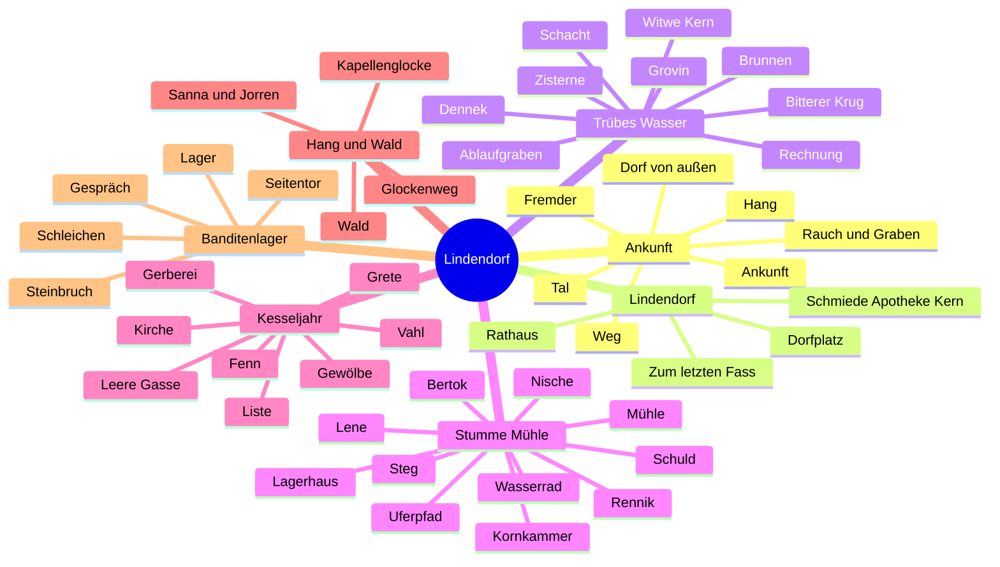
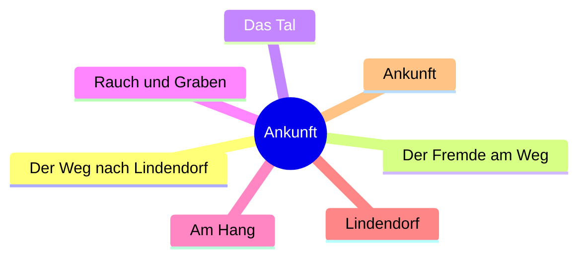
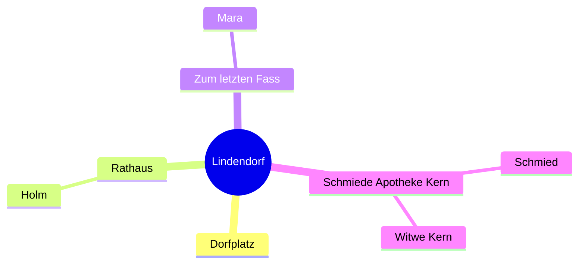
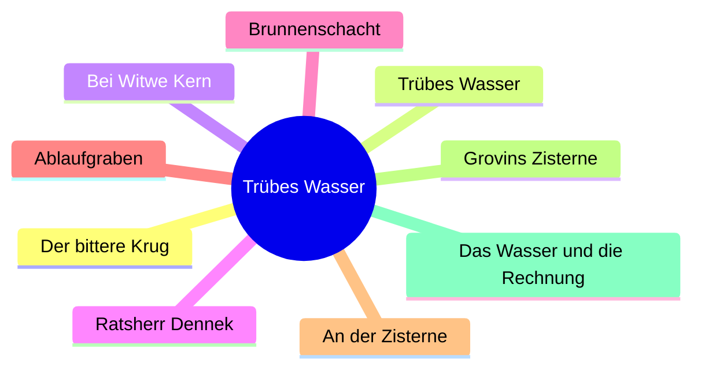
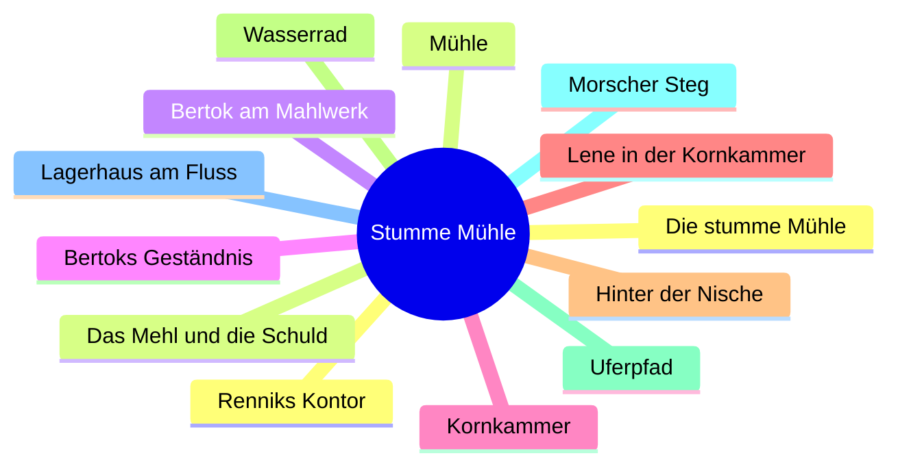
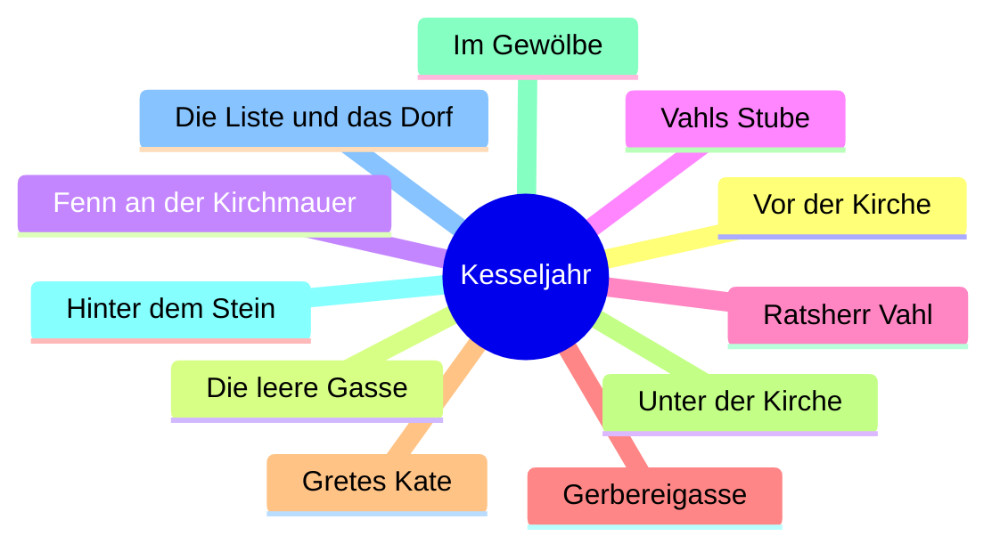
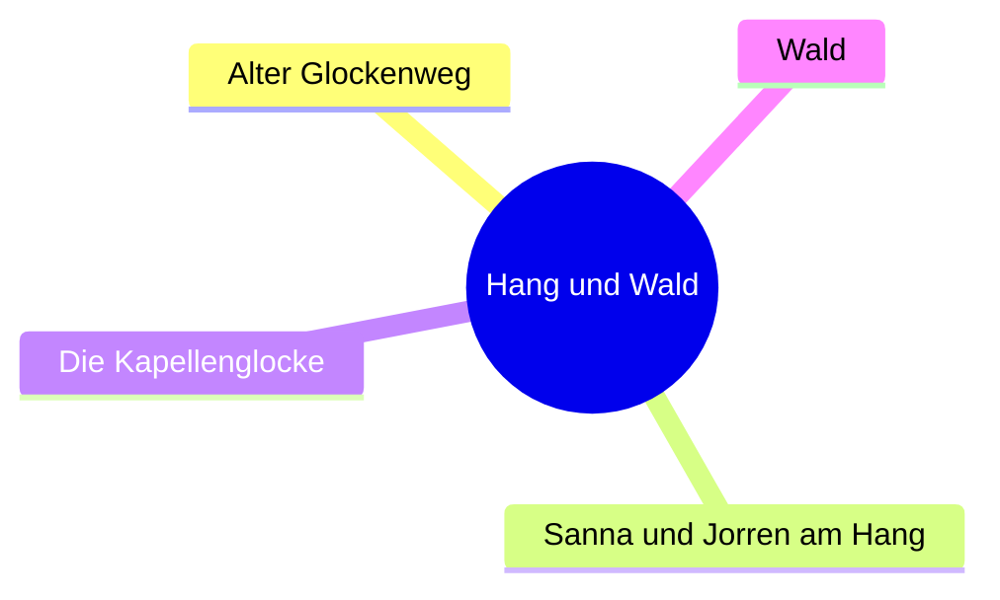
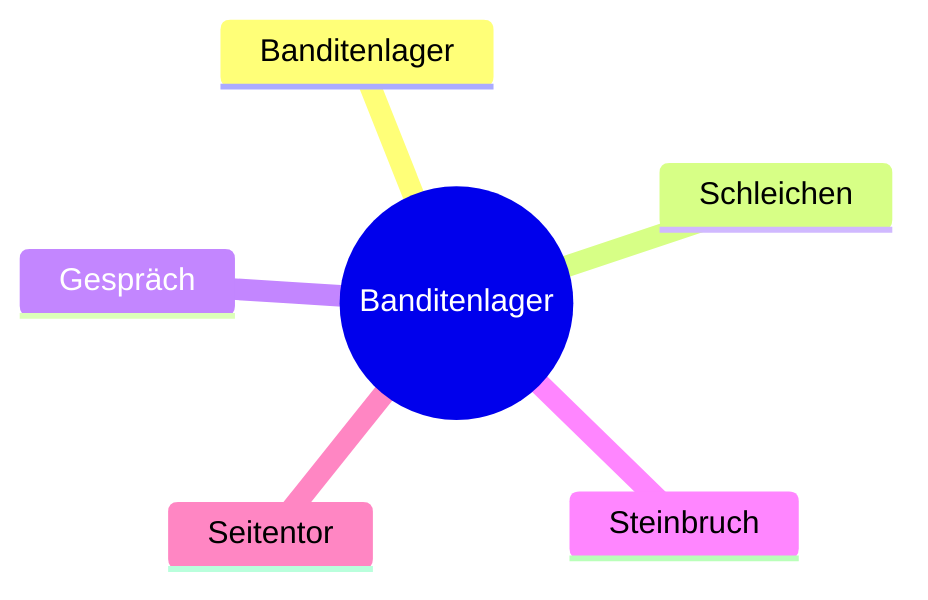

# Informationsblätter

Sieben Quests, ihre Orte, die Figuren daran und die Wissensanker. Quelle ist der Szenenplan und das Questregister, nicht eine neue Welt. Kirche und Gewölbe sitzen im Kesseljahr, nicht als achte Quest.

## Alle sieben

## 1. Ankunft

Atem, Spur, noch keine Erklärung. Das Artefakt und das rote Wachs werden nur gezeigt.

Figuren: der Fremde. Anker: `dorf_ankunft`, `artefakt_gesehen`, `hang_hinweis`.

## 2. Lindendorf

Der Platz ist die Nabe. Holm nennt nur die Banditen.

Anker: `holm_besucht`, `auftrag_erhalten`, `banditen_bekannt`, `rotes_siegel_gesehen`.

## 3. Trübes Wasser

Das Wasser wird nicht knapp. Ein Teil läuft zu Grovins Zisterne. Dennek weiß es.

Anker: `wasser_truebung`, `grovin_zisterne`, `dennek_schuld`. Mit der Mühle zusammen: `versorgung_muster`.

## 4. Die stumme Mühle

Das Rad läuft. Das Mehl nicht. Hinter der Nische sitzen Menschen, die das Dorf nicht zählt.

Figuren: Bertok, Lene, Yorwin, Rennik. Anker: `muehle_stillstand`, `renniks_druck`, `fluechtlinge_muehle`.

## 5. Das Kesseljahr

Die Gasse wurde aus den Listen genommen. Die Liste liegt unter der Kirche.

Figuren: Fenn, Vahl, Grete, der Pfarrer, Ilse nur als Liste. Anker: `gasse_leer`, `kesseljahr`, `ilses_liste`.

## 6. Hang und Wald

Alter Transportweg. Salz, Nachricht, Glocke als Signal. Der Steinbruch ist das Ende des Wegs, noch nicht das Lager.

Figuren: Sanna, Jorren. Anker: `glockenweg_bekannt`, `glocke_vorteil`.

## 7. Banditenlager

Die Banditen bewachen einen Weg, den jemand im Dorf bestellt hat.

Anker: `banditen_gewarnt`. Der Auftrag dazu kommt von Holm, nicht aus dem Lager.

## Figurenblatt

| Quest | Wer dort steht |
|---|---|
| Ankunft | der Fremde |
| Lindendorf | Holm, Mara, der Schmied, Witwe Kern |
| Trübes Wasser | Dennek, Witwe Kern, Grovin, der Bettler |
| Stumme Mühle | Bertok, Lene, Yorwin, Rennik |
| Kesseljahr | Fenn, Vahl, Grete, der Pfarrer, Ilse nur auf der Liste |
| Hang und Wald | Sanna, Jorren |
| Banditenlager | die Wache, Holm nur als Auftrag |

`ungerufener_name` hat keinen eigenen Ort. Der Faden läuft über Rinne, Mehlsack, Bettler, Mara, Holm, Glocke und den Köhler.

## Was der Held nicht sieht

Dieselbe Karte. An jedem Ort nur die eine Zeile, die dort wahr ist. Sie steht in `lore.ts`. Sie gehört ins Werkzeug, nicht in den Text, den der Held liest.

### Ankunft

| Ort | Die Zeile |
|---|---|
| Der Weg nach Lindendorf | Der Held kommt allein und zu Fuß. Lindendorf ist auf der Karte kaum mehr als ein Tintenfleck. |
| Der Fremde am Weg | Er ist namenlos, mager, der linke Ärmel blutig. Unter dem Mantel liegt kein Schmuck, sondern ein Rest des Siegels: ein offenes Auge über drei Linien. |
| Das Tal | Über dem Tal steht Rauch ohne Wind. Am Waldrand steckt ein Kinderschuh im Schlamm. |
| Rauch und Graben | Derselbe Rauch, dieselben offenen Zäune. Der Graben ist noch keine Erklärung. |
| Am Hang | Der Hang trägt die Spur schon, aber noch nicht den Weg, der später Salz und Namen trug. |
| Lindendorf | Vom Dorf aus sind Rathaus, Taverne, Brunnen, Mühle und der Weg zum Hang sichtbar. Im Osten raucht der Steinbruch. |
| Ankunft | Dasselbe Bild. Noch nennt niemand Wasser, Mehl oder die Gasse. |

### Lindendorf

| Ort | Die Zeile |
|---|---|
| Dorfplatz | Das Amt benennt öffentlich nur die Banditen im Steinbruch. Wasser, Mehl und die leere Gasse bleiben ungesagt. |
| Rathaus | Holm gibt den Auftrag gegen das Lager. Er ist der Bürgermeister, nicht Dennek und nicht Vahl. |
| Zum letzten Fass | Mara kann den schmalen Pfad hinter der Taverne zeigen. Der macht den Steinbruch später leichter. |
| Schmiede, Apotheke, Kern | Der Schmied hat hier keine eigene Schuld. Kern ist die Heilerin, noch nicht die Zeugin am trüben Eimer. |

### Trübes Wasser

| Ort | Die Zeile |
|---|---|
| Der bittere Krug | Der Eimer ist graubraun und schmeckt nach Eisen. „Trockenes Jahr“ ist Denneks Satz, nicht die Ursache. |
| Trübes Wasser | Dennek rührt und meidet dabei eine Fuge am Rand. |
| Bei Witwe Kern | Sie hält es nicht für Krankheit allein. Jemand hat den Brunnen angefasst. |
| Ratsherr Dennek | Er hat Grovin den Lohn bewusst vorenthalten, damit das Wasser ein Druckmittel bleibt. |
| Brunnenschacht | Der Mörtel an der Fuge ist frisch. Dahinter läuft ein Ablauf, zu gerade für wildes Wasser. |
| Ablaufgraben | Der Graben führt Richtung Wald, zur Zisterne, deren Dornen gelegt sind, nicht gewachsen. |
| An der Zisterne | Das Wasser darin ist klar. Grovin schöpft für sich, nicht für den Eimer im Dorf. |
| Grovins Zisterne | Er hat den Brunnen gebaut und nie Lohn gesehen. Er will Anerkennung, nicht Gift. |
| Das Wasser und die Rechnung | Bestechen reicht nicht für alle. Zerstören ohne entlarvten Dennek lässt Grovin als Spur. Verhandeln oder öffnen macht das Wasser klar. |

### Die stumme Mühle

| Ort | Die Zeile |
|---|---|
| Die stumme Mühle | Das Rad schlägt, es mahlt nichts. Die Stille deckt die Kammer. |
| Mühle | Schlechtes Korn und niedriger Wasserstand sind die Sätze für den ersten Besuch. |
| Bertok am Mahlwerk | Seine Hände sind mehlweiß, obwohl seit Tagen nichts gemahlen wurde. |
| Bertoks Geständnis | Vertrauen oder Druck bringt ihn auf Rennik. Bei genug Vertrauen zieht er den Schuldschein aus dem Mahlstein. |
| Kornkammer | Lene zählt dieselben Säcke und stellt sich vor die hintere Wand. |
| Lene in der Kornkammer | Sie ist Bertoks Tochter, nicht Sanna. Ihre Schwester ist tot. |
| Hinter der Nische | Dort sitzen Yorwin und zwei Kinder, Leute, die das Kesseljahr aus den Listen genommen hat. |
| Wasserrad | Schleifspuren eines Sacks und ein Kinderschuh Richtung Ufer widersprechen Bertoks Satz vom niedrigen Wasser. |
| Uferpfad | Der Pfad führt zum morschen Steg und zum Wächter am Lagerhaus. |
| Morscher Steg | Wer einbricht, fällt ins kalte Wasser und warnt den Wächter. |
| Lagerhaus am Fluss | Vorbei kommt man schleichend, mit Bertoks Namen oder im Kampf. |
| Renniks Kontor | An der Wand hängt Bertoks Schuldschein. Rennik sagt den Namen nicht. Der Schein sagt ihn. |
| Das Mehl und die Schuld | Verrat an Holm schützt die Mühle und macht Bertok kalt. Der Schein löst sie leise. Kampf lässt Blut am Steg. |

### Das Kesseljahr

| Ort | Die Zeile |
|---|---|
| Vor der Kirche | Fenn sitzt an der Kirchmauer, nicht am Brunnen. Den ganzen Pakt sagt er nicht. |
| Die leere Gasse | Hinter der Gerberei liegt die kürzeste Strecke zum Fluss, und niemand geht sie. |
| Fenn an der Kirchmauer | Als Kind hat er gesehen, wie Menschen aus der Gasse geholt wurden. Vahls Großvater hat zuerst gezeichnet. |
| Vahls Stube | Vahl nennt den Bau Ordnung. Beim Großvater sagt er „Verantwortung“ und bricht ab. |
| Ratsherr Vahl | Sobald es um die Aufteilung geht, hört er auf. |
| Gerbereigasse | Kratzspuren in Fünfergruppen, ein zugewachsener Ziehbrunnen, ein Holzpferd ohne Beine. Vahl will hier in einer Woche ein Lagerhaus. |
| Gretes Kate | Drängen sperrt sie dauerhaft. Die Liste liegt unter der Kirche, dritter Stein von links, Wachs aus der Gerberei. |
| Unter der Kirche | Der Pfarrer lässt einen bittenden Helden leichter hinunter, wenn das Kirchensilber vom Weg dabei ist. |
| Im Gewölbe | Ilses Wachstuch nennt Namen, Daten und die drei Familien Vahl, Dennek und Holm. |
| Hinter dem Stein | Wer sich wehrte, hat keinen Eintrag. Die Kirche hält, was das Amt nicht zählen will. |
| Die Liste und das Dorf | Vorlesen nimmt Vahl den Sitz. Holm zustecken legt die Wahrheit in die Schublade. Verbrennen löscht die Namen, und die Gasse wird bebaut. |

### Hang und Wald

| Ort | Die Zeile |
|---|---|
| Alter Glockenweg | Der Weg trug Salz, Mehl, Listen und die, die nicht mehr gezählt wurden. Die Glocke ist das Signal dafür, kein Gebet. |
| Sanna und Jorren am Hang | Sanna verlor eine versiegelte Nachricht im Geröll. Jorren haftet für das Salz. Rotes Wachs markiert, was nicht zurückkehren darf. |
| Die Kapellenglocke | Das Seil zu sichern lässt das Lager unvorbereitet. Scheitert es, läutet die Glocke, und die Banditen wissen, dass jemand kommt. |
| Wald | Diesen Weg bewachen die Banditen für jemanden im Dorf. |

Unter der Kapelle liegt keine geweihte Kammer, sondern eine ältere Grube. Ob dort vor dreißig Jahren etwas gebunden wurde, bleibt offen. Das sagt die Zeile nicht laut, auch nicht dem Spielleiter als Tatsache.

### Banditenlager

| Ort | Die Zeile |
|---|---|
| Banditenlager | Kess bewacht den alten Transportweg für jemanden im Dorf. In der Kiste liegt das Siegel der Kirche, darunter Listen. Neben manchen Namen steht nur ein Kreuz. |
| Schleichen | Das Silber lässt sich unbemerkt nehmen, leichter nach Maras Pfad und stiller Glocke. |
| Gespräch | Kess sagt, das hier habe vor dem Auftrag angefangen. Er glaubt an Galgen, nicht an Helden. |
| Steinbruch | Drei Zelte, ein Feuer, ein Kinderumhang, den niemand anfasst. |
| Seitentor | Der Schlüssel kommt vom Fluss. Kess sagt, sein Tod gebe dem Dorf nichts zurück. |

Die Kiste ist leichter, als das Silber vermuten lässt. Die Banditen leben kaum besser als die, die sie bestehlen.

### Nicht auf der Karte

Die Rückkehr zu Holm ist kein Heilungsende. Sie zeigt nur, welchen Zustand die Wege hinterlassen: die Lüge bleibt, Namen werden laut, Grovin wird anerkannt, oder die Mühle versteckt ihre Leute weiter.

## Weitere Blätter, noch nicht gezeichnet

1. **Enden.** Sechs Dorfzustände aus einer Wahl je Quest, nicht aus einem letzten Kampf.
2. **Zustände.** Welcher Ort gibt und nimmt: nass am Brunnen, Hunger an der Mühle, Furcht am Tor.
3. **Proben.** Welche Seite Stärke, Geschick oder Charisma verlangt, und welche Tageszeit sie verschiebt.

